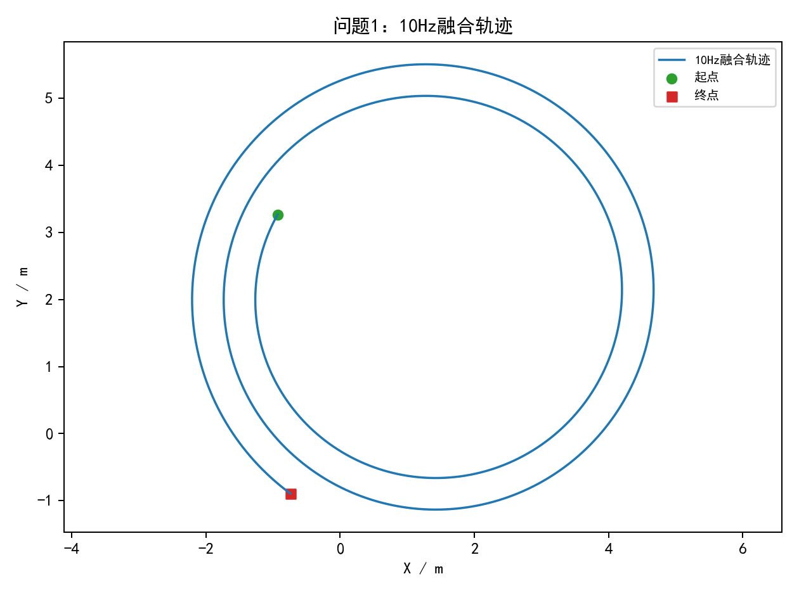
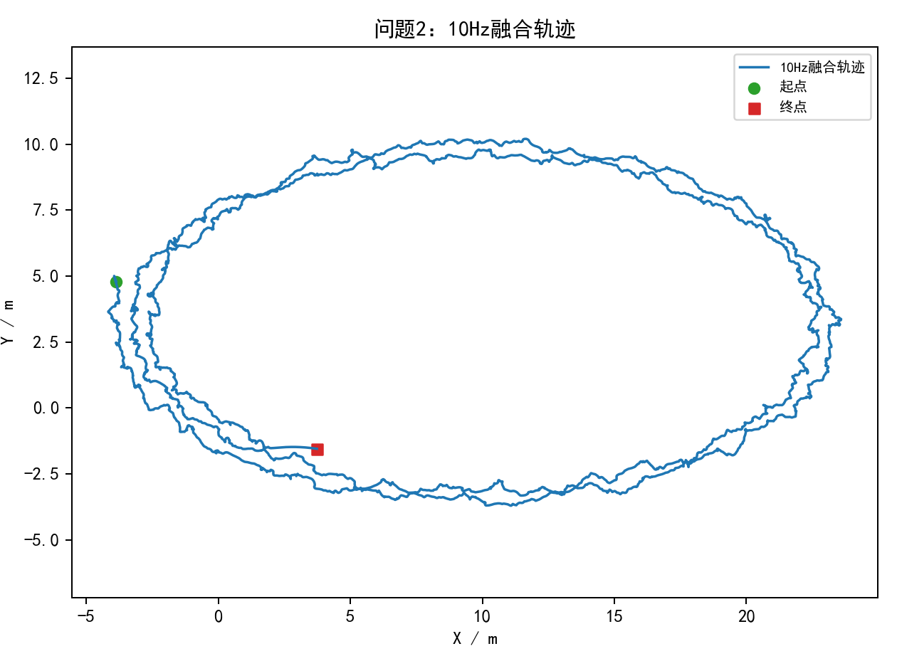
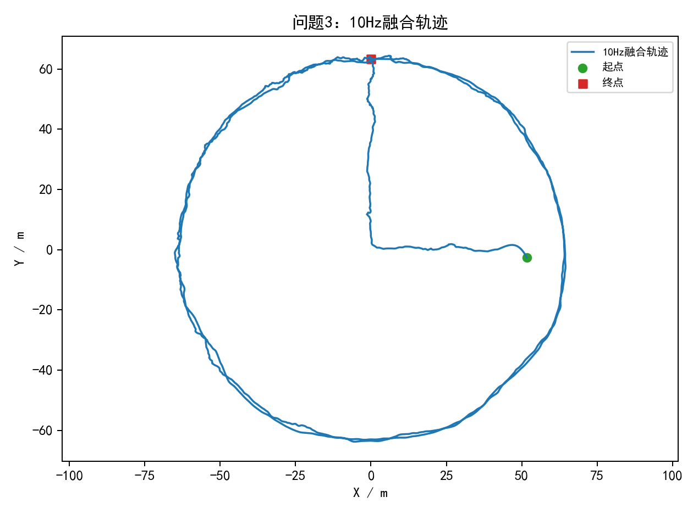
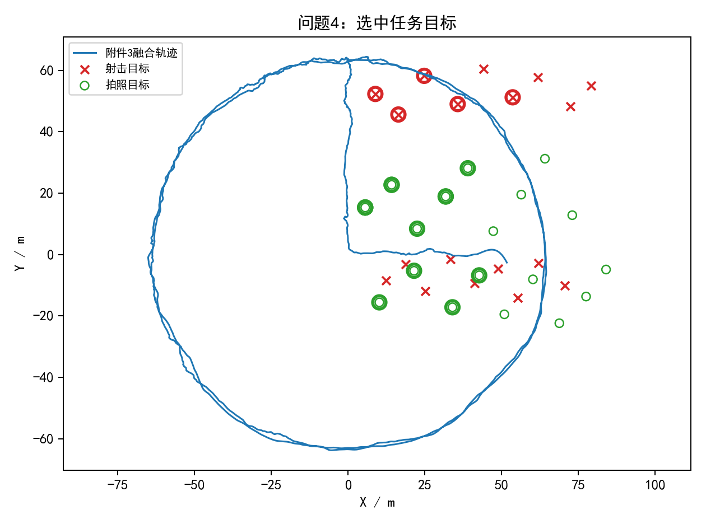

# B题 多源融合机器人定位及任务优化

## 摘要

针对两种异频异步定位方式，本文建立“时间平移—固定偏差估计—10Hz重采样融合”的多源定位模型。问题1在无噪声条件下，以方式1为基准得到方式2相对时间偏差为 198.4317s，时间平移后两轨迹均方残差接近0。问题2在随机噪声和固定系统偏差并存条件下，估计方式2相对时间偏差为 50.5731s，95%置信区间为 [50.5679,50.5762]s，方式2相对方式1的固定坐标偏差为 (3.4923,-1.8225)m。问题3实测数据经F检验，在α=0.05水平上检出系统偏差（F=25.17, p=1.44e-11），偏差估计值为 (-0.1495,-0.2095)m；偏差模长0.257m、误差改善1.65%，虽量级较小，仍按统计结论予以修正。问题4在附件3融合轨迹上生成可行任务候选，并用0-1整数规划最大化期望完成数，得到 18 项非重叠任务，其中模拟射击 5 项、拍照 13 项，期望完成数为 17.25。全部任务满足距离、速度、加速度、准备时间和拍照角度约束。

**关键词：** 多源定位；时间同步；系统偏差；10Hz重采样；整数规划；任务优化

## 1 问题重述

题目给出定位方式1（4Hz）和定位方式2（5Hz）两组二维定位数据。两种方式存在采样频率不同、启动时间不同、随机噪声以及可能的固定系统偏差。问题1要求在无噪声情形下完成时间对齐并输出10Hz轨迹；问题2要求在噪声和系统偏差下同时估计时间偏差、坐标偏差并输出10Hz轨迹；问题3要求对实测数据判断是否存在系统偏差并完成融合；问题4要求机器人沿附件3轨迹运动时，在题面附录约束下尽可能多地完成模拟射击和拍照扫描任务，并填写结果表。

## 2 模型假设

1. 方式1作为时间基准，方式2经时间平移后为 $\tau=t_2-\delta$。
2. 若存在固定系统偏差，则方式2修正坐标为 $p_2'=p_2-b$，其中 $b=(b_x,b_y)$。
3. 两方式在重叠时间区间内描述同一条实际轨迹；融合输出采用10Hz网格。
4. 问题4中同一时段机器人只能准备或执行一项任务，因此任务区间不能重叠；射击目标最多执行一次，拍照目标可从多个方向拍摄，但同一目标任意两次拍照方向角差至少60度。
5. 题面未给出额外冷却时间或任务优先级，故优化目标取为最大化期望完成数：拍照权重1，模拟射击权重0.85。

## 3 时间对齐与偏差估计模型

对给定 $\delta$，先将方式2时间修正为 $t_2-\delta$，再在两条轨迹的重叠区间按0.1s网格插值，得到 $q_1(t)$ 与 $q_2(t-\delta)$。若重叠时长过短，局部形状相似会造成伪匹配，因此搜索时要求重叠时长不低于较短轨迹时长的85%。无偏模型最小化

$$
J_0(\delta)=\frac1n\sum_t \|q_2(t-\delta)-q_1(t)\|^2 .
$$

带偏模型在每个候选 $\delta$ 下用坐标差的中位数估计固定偏差

$$
\hat b(\delta)=\operatorname{median}_t\,[q_2(t-\delta)-q_1(t)],
$$

并最小化截尾均方误差

$$
J_1(\delta)=\frac1n\sum_t \|q_2(t-\delta)-q_1(t)-\hat b(\delta)\|^2 .
$$

实际求解时先在允许区间内粗搜索，再用有界一维优化细化 $\delta$。对问题2、问题3，本文比较无偏模型和带偏模型的残差平方和，采用嵌套模型F检验判断固定偏差项是否具有统计显著性（$\alpha=0.05$）：若p值小于0.05，则判定存在系统偏差，使用带偏模型估计偏差值并修正轨迹。由于大样本下微小均值漂移也可能被检出，本文在结果中附加工程效应量（误差下降比例和偏差模长）作为量级参考，但不改变统计检验的确定性结论。

时间偏差置信区间采用残差重采样的线性化估计。对最优解附近，$\delta$ 的微小变化等价于沿方式2局部速度方向扰动轨迹，因此可由重采样残差和局部速度的最小二乘关系得到 $\delta$ 的扰动分布，并取2.5%和97.5%分位数作为95%置信区间。

## 4 10Hz轨迹融合

在修正后的公共时间区间上，以0.1s为步长重采样两种定位方式。融合位置为

$$
p_f(t)=\frac12\left(q_1(t)+q_2(t-\delta)-\hat b\right).
$$

含噪数据的速度和加速度由Savitzky-Golay平滑后的轨迹差分估计，用于问题4任务约束检查。

## 5 任务优化模型

对每个候选目标逐时刻检查距离、速度、加速度约束，并用滚动窗口保证准备区间内约束全部成立。射击任务准备时长为1.5s，拍照任务准备时长为0.5s。对拍照目标，方向角由机器人指向目标点的向量计算；同一目标的任意两次拍照若方向角差小于60度，则不能同时选择。

候选任务 $i$ 具有准备开始时间 $s_i$、执行时间 $e_i$ 和期望收益 $w_i$。拍照任务成功收益取1，模拟射击任务按85%命中率取期望收益0.85。建立0-1整数规划：

$$
\max \sum_i w_i x_i
$$

约束包括：

1. 任意两个准备/执行区间重叠的任务不能同时选择，$x_i+x_j\le1$。
2. 同一射击目标最多执行一次。
3. 同一拍照目标中，方向角差小于60度的两次拍照不能同时选择。

候选任务数为 337，求解状态为 `milp_optimal`。该模型在10Hz离散候选集上给出全局最优解；连续时间下的更细优化可在后续用更小步长继续逼近。

## 6 结果

### 6.1 时间偏差与系统偏差

| 问题 | delta/s | delta 95%CI/s | 采用bias_x/m | 采用bias_y/m | 候选bias_x/m | 候选bias_y/m | 误差下降 | 系统偏差结论 |
|---|---:|---:|---:|---:|---:|---:|---:|---|
| 1 | 198.4317 | -- | 0 | 0 | -- | -- | -- | 无 |
| 2 | 50.5731 | [50.5679,50.5762] | 3.4923 | -1.8225 | 3.4923 | -1.8225 | 98.26% | 存在并修正 |
| 3 | -367.9214 | [-367.9282,-367.9133] | -0.1495 | -0.2095 | -0.1495 | -0.2095 | 1.65% | 存在并修正（量级较小） |

### 6.2 分题轨迹图

### 6.3 任务优化结果

| target_id | task | prep_start_s | exec_time_s | distance_m | speed_m_s | accel_m_s2 | angle_deg | expected_success |
| --- | --- | --- | --- | --- | --- | --- | --- | --- |
| P04 | 拍照 | 476.5000 | 477.0000 | 18.3236 | 1.0964 | 0.3635 | 78.5032 | 1.0000 |
| P13 | 拍照 | 477.0000 | 477.5000 | 17.3932 | 0.8683 | 0.4188 | 330.9585 | 1.0000 |
| P12 | 拍照 | 481.0000 | 481.5000 | 22.2972 | 0.8364 | 0.3170 | 308.6717 | 1.0000 |
| P01 | 拍照 | 481.7000 | 482.2000 | 20.6399 | 1.3757 | 0.5306 | 133.4132 | 1.0000 |
| P01 | 拍照 | 488.4000 | 488.9000 | 14.6695 | 1.2878 | 1.2673 | 71.1097 | 1.0000 |
| P04 | 拍照 | 492.6000 | 493.1000 | 33.5617 | 0.3841 | 0.4936 | 13.2672 | 1.0000 |
| P02 | 拍照 | 493.1000 | 493.6000 | 19.0358 | 0.3068 | 0.6055 | 35.1911 | 1.0000 |
| P11 | 拍照 | 493.6000 | 494.1000 | 28.4608 | 0.6404 | 0.3325 | 322.4343 | 1.0000 |
| P10 | 拍照 | 494.1000 | 494.6000 | 29.8615 | 0.7778 | 0.4976 | 291.3170 | 1.0000 |
| P03 | 拍照 | 494.6000 | 495.1000 | 22.9921 | 1.4743 | 0.8241 | 349.4506 | 1.0000 |
| S12 | 模拟射击 | 507.2000 | 508.7000 | 26.6631 | 0.7624 | 0.2358 |  | 0.8500 |
| P02 | 拍照 | 508.8000 | 509.3000 | 28.9549 | 1.1069 | 0.1134 | 299.4933 | 1.0000 |
| P01 | 拍照 | 509.3000 | 509.8000 | 33.3273 | 0.5986 | 0.1336 | 280.0816 | 1.0000 |
| S10 | 模拟射击 | 510.2000 | 511.7000 | 10.4263 | 1.6011 | 0.5394 |  | 0.8500 |
| S11 | 模拟射击 | 513.4000 | 514.9000 | 19.6110 | 1.6044 | 0.2684 |  | 0.8500 |
| P05 | 拍照 | 750.3000 | 750.8000 | 22.4832 | 1.3729 | 0.1506 | 269.0805 | 1.0000 |
| S15 | 模拟射击 | 751.0000 | 752.5000 | 16.5890 | 1.9053 | 0.1917 |  | 0.8500 |
| S13 | 模拟射击 | 762.0000 | 763.5000 | 29.7331 | 0.9917 | 0.2767 |  | 0.8500 |

## 7 结果检验

程序对输出任务进行了自动复核：全部选中任务在准备区间和执行时刻均满足距离、速度、加速度约束；任务区间互不重叠；同一拍照目标的多次拍照方向角差不小于60度；结果表只写入A:E答案区，未改动右侧红色说明区域。

### 7.1 平滑窗口敏感性

速度和加速度由融合轨迹差分得到，因此平滑窗口会影响临界任务的可行性。本文以问题3轨迹为基础，对不同平滑窗口重新生成候选任务并求解整数规划，结果如下。

| 平滑窗口(点) | 候选任务数 | 选中任务数 | 期望完成数 | 求解状态 | 校验 |
| --- | --- | --- | --- | --- | --- |
| 51 | 210 | 15 | 14.4000 | milp_optimal | PASS |
| 61 | 326 | 17 | 16.4000 | milp_optimal | PASS |
| 71 | 337 | 18 | 17.2500 | milp_optimal | PASS |
| 81 | 358 | 17 | 16.1000 | milp_optimal | PASS |
| 91 | 346 | 17 | 15.6500 | milp_optimal | PASS |

主方案选用71点窗口，原因是该窗口在抑制测量噪声的同时保留了轨迹转向细节，并给出了自动约束复核通过的最高期望完成数。敏感性结果说明任务优化对平滑强度存在一定依赖，因此最终提交同时保留候选任务表和校验报告，便于复核。

## 8 模型评价

模型优点是参数含义清晰、数据驱动且可复现；时间对齐采用重叠时长约束和截尾误差，能降低噪声与局部异常点影响；系统偏差判定以F检验为统计依据，并附加工程效应量作为量级参考；问题4用0-1整数规划统一处理时间互斥、射击唯一性和拍照角度冲突，比简单贪心更稳健。局限在于速度和加速度由定位轨迹差分得到，受平滑窗口影响；任务优化是在10Hz离散轨迹上的最优解，若需要连续时间全局最优，可进一步建立更细粒度的混合整数规划。

## 参考文献

[1] Savitzky A, Golay M J E, Smoothing and Differentiation of Data by Simplified Least Squares Procedures, Analytical Chemistry, 36(8):1627-1639, 1964.
